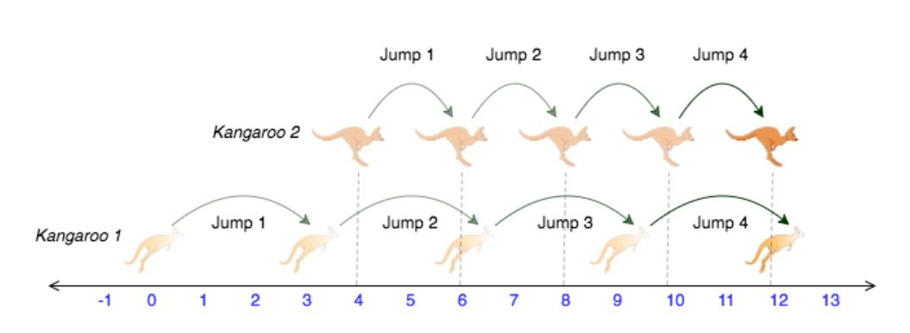

# Number Line Jumps

You are choreographing a circus show with various animals. For one act, you are given two kangaroos on a number line ready to jump in the positive direction (i.e, toward positive infinity).

- The first kangaroo starts at location  and moves at a rate of  meters per jump.
- The second kangaroo starts at location  and moves at a rate of  meters per jump.
You have to figure out a way to get both kangaroos at the same location at the same time as part of the show. If it is possible, return YES, otherwise return NO.

For example, kangaroo 1 starts at `x1 = 2` with a jump distance `v1 = 1` and kangaroo 2 starts at `x2 = 1` with a jump distance of `v2 = 2`. After one jump, they are both at `x = 3`, (`x1 + v1 = 3, x2 + v2 = 3`), so our answer is YES.

## Function Description

Complete the function kangaroo. It should return YES if they reach the same position at the same time, or NO if they don't.

kangaroo has the following parameter(s):

- x1, v1: integers, starting position and jump distance for kangaroo 1
- x2, v2: integers, starting position and jump distance for kangaroo 2

## Input Format

A single line of four space-separated integers denoting the respective values of x1, v1, x2 and v2.

## Constraints

- 0 <= x1 <= x2 <= 10000
- 1 <= v1 <= 10000
- 1 <= v2 <= 10000

## Output Format

Print YES if they can land on the same location at the same time; otherwise, print NO.

Note: The two kangaroos must land at the same location after making the same number of jumps.

## Sample Input 0

0 3 4 2

## Sample Output 0

YES

## Explanation 0

The two kangaroos jump through the following sequence of locations:

From the image, it is clear that the kangaroos meet at the same location (number 12 on the number line) after same number of jumps (4 jumps), and we print YES.

## Sample Input 1

0 2 5 3
## Sample Output 1

NO
## Explanation 1

The second kangaroo has a starting location that is ahead (further to the right) of the first kangaroo's starting location (i.e. x2 > x1 ). Because the second kangaroo moves at a faster rate (meaning v2 > v1) and is already ahead of the first kangaroo, the first kangaroo will never be able to catch up. Thus, we print NO.
